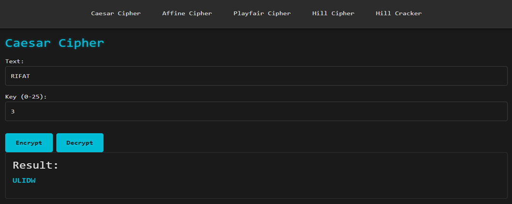
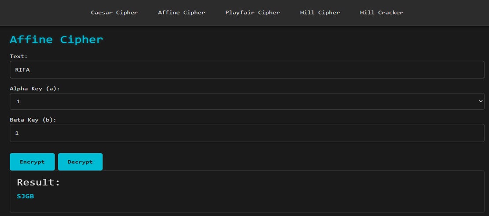
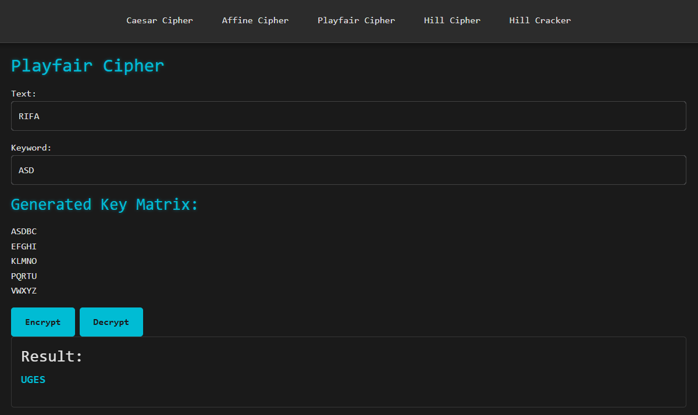
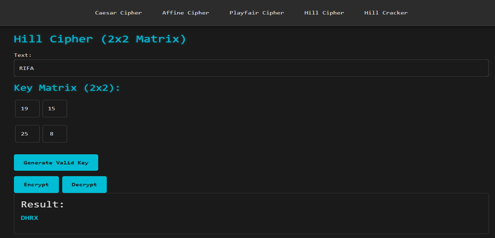
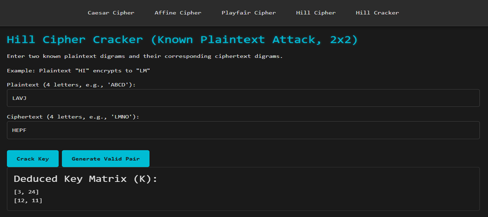

# Encryption/Decryption Tool & Crypto Cracker

This is an Angular-based web application providing an interactive tool for encrypting and decrypting messages using several classical ciphers. It also includes a specialized cracker for the Hill Cipher using a known plaintext attack.

## Features

*   **Caesar Cipher:** Simple substitution cipher with a shift key (0-25).
*   **Affine Cipher:** Monoalphabetic substitution cipher with a two-part key (a, b).
*   **Playfair Cipher:** Digraphic substitution cipher using a keyword to generate a 5x5 matrix.
*   **Hill Cipher (2x2 Matrix):** Polygraphic substitution cipher using a 2x2 matrix as a key. Includes a valid key generator.
*   **Hill Cracker (Known Plaintext Attack):** A tool to deduce the Hill Cipher's key matrix from known plaintext-ciphertext pairs. Includes a valid pair generator.
*   **User-Friendly Interface:** Clean, dark-themed UI with real-time input validation and animated result displays.

## UI Screenshots

Below are some screenshots illustrating the application's user interface and functionality.

### Caesar Cipher


### Affine Cipher


### Playfair Cipher


### Hill Cipher


### Hill Cipher Cracker


## Prerequisites

This project was developed and tested with the following environment. To ensure compatibility and avoid potential issues, it is highly recommended to set up your environment as follows.

**Recommended Versions:**
*   **Node.js:** `v20.19.6`
*   **npm (Package Manager):** `v10.8.2`
*   **Angular CLI:** `v21.0.4`

### Step 1: Install nvm-windows
Using a version manager for Node.js is the most reliable way to set up the environment.

1.  **Download `nvm-windows`:** Go to the [nvm-windows releases page](https://github.com/coreybutler/nvm-windows/releases) and download the `nvm-setup.zip` file from the latest release.
2.  **Run the Installer:** Extract the zip file and run the installer. **Note:** It's recommended to uninstall any existing versions of Node.js before installing `nvm-windows` to avoid conflicts.

### Step 2: Configure Node.js & Angular CLI
1.  **Open Command Prompt or PowerShell as an Administrator.**

2.  **Install and Use the Correct Node.js Version:**
    Run the following commands to install and use the project's recommended Node.js version.
    ```bash
    nvm install 20.19.6
    nvm use 20.19.6
    ```
    This command will set your current terminal session to use Node.js `v20.19.6` and `npm v10.8.2`.

3.  **Install Angular CLI:**
    Install the specific version of Angular CLI used for this project globally:
    ```bash
    npm install -g @angular/cli@21.0.4
    ```

## Installation

1.  **Clone the repository:**
    ```bash
    git clone https://github.com/s-rifat/Encryption-Decryption-Tool.git
    cd Encryption-Decryption-Tool
    ```
2.  **Navigate to the Angular project directory:**
    ```bash
    cd encrypt-decrypt-tool
    ```
3.  **Install npm dependencies:**
    ```bash
    npm install
    ```

## Running the Application

To run the application in development mode:

1.  **Navigate to the Angular project directory** (if you're not already there):
    ```bash
    cd encrypt-decrypt-tool
    ```
2.  **Start the development server:**
    ```bash
    npm start
    ```
    This will compile the application and start a local server.
3.  **Open your browser** and navigate to `http://localhost:4200/`. The application will automatically reload if you change any of the source files.
